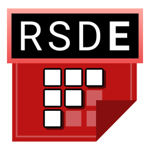

# RHRE SFX Database Editor

RSDE is a GUI SFX Database editor for [RHRE](https://github.com/chrislo27/RhythmHeavenRemixEditor).

## Requirements
* [Java 8u60 minimum up to Java 10](https://java.com/en/download/)
* A compatible [RHRE](https://github.com/chrislo27/RhythmHeavenRemixEditor) version to have already been installed and ran at least once

## Other information
Rhythm Heaven is not my property -- it is the property of Nintendo. 
This program is **NOT** endorsed or sponsored in any way by Nintendo. 
All used properties of Nintendo (such as names, audio, graphics, etc.) in this software are not intended to maliciously infringe trademark rights. 
This is a community project and this is available for others to use
however they like (abiding by the code's Apache-2.0 license), for free.

RSDE logo designed by [GlitchyPSIX](https://www.youtube.com/user/supermarioglitchy33/). 
